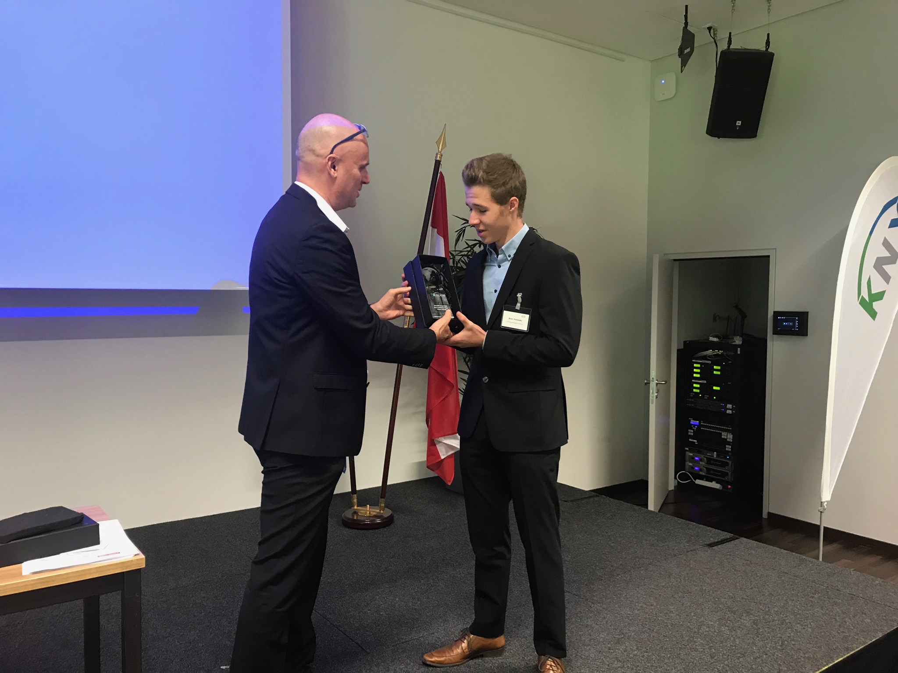

# KNX Scientific Conference 2018 paper

Every two years, `KNX Association` organizes the KNX Scientific Conference. The 2018 edition took place in Vienna, Austria. Students, professors and companies present their recent innovations. I **won** the **KNX Scientific Award 2018** at age 17, as youngest speaker.

## My 2018 submission

- **Title**: LoRa as a secure and wireless complement to KNX
- **Co-author**: [Filip Van Craenenbroeck](http://5abox.com)
- **Check it out**: [Open paper as PDF](Paper.pdf)

## Award reception

*KNX CTO [Joost Demarest](https://www.linkedin.com/in/joost-demarest-75618160/?originalSubdomain=be) handing out the KNX Scientific Award 2018.*

### Articles

- [KNX Association article](https://www.knx.org/knx-en/for-professionals/newsroom/en/news/KNX-Scientific-Conference-2018/)
- [KU Leuven article](https://lirias.kuleuven.be/retrieve/528316)
- [University of Applied Sciences Vienna](https://www.technikum-wien.at/en/newsroom/news/knx-certification-conference-and-scientific-partner-at-uas-technikum-wien/)
